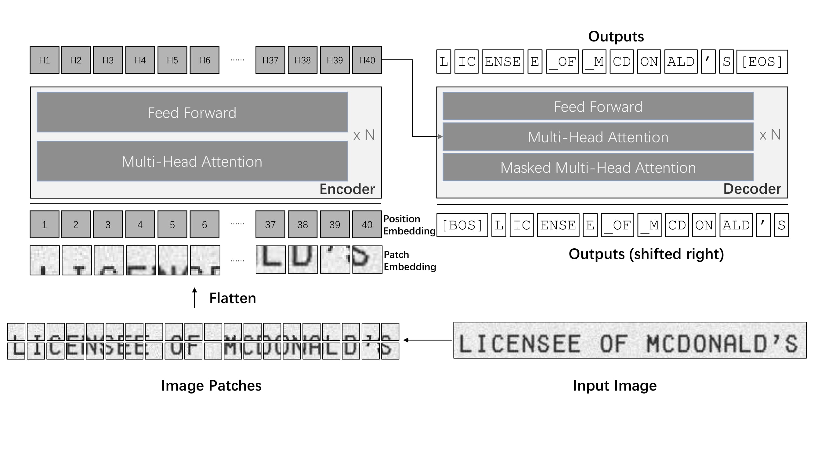
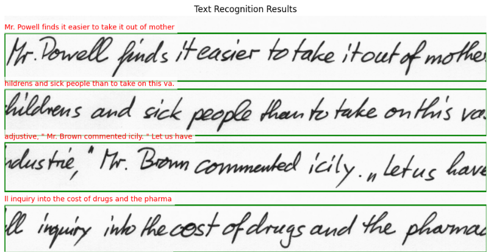
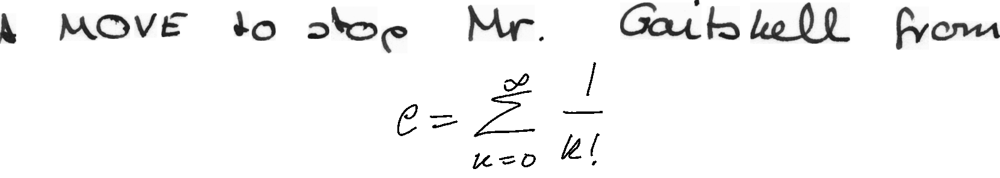
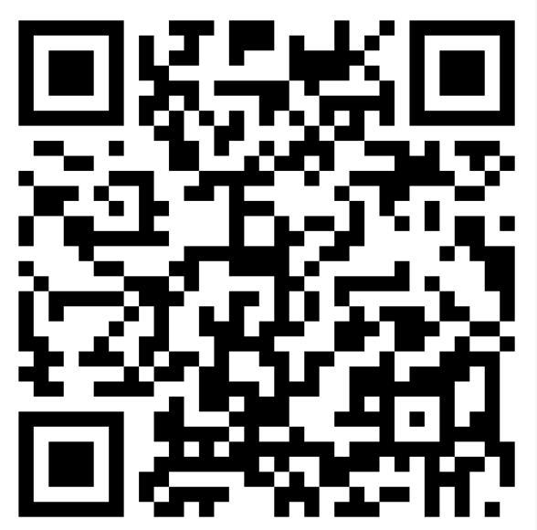
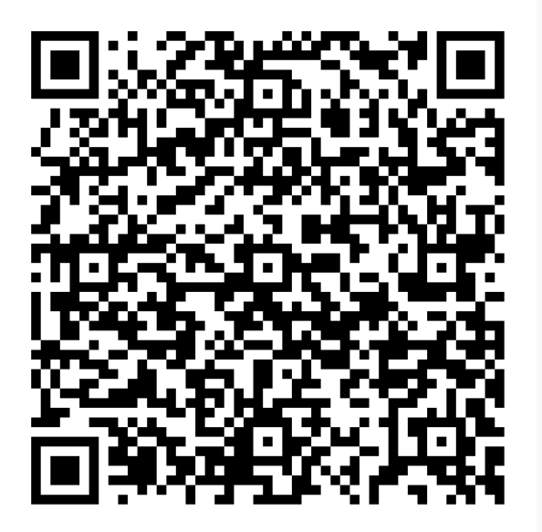

# IE643 Course Project: Developing a Tool for Converting Raw Technical Handwritten Scanned Images into a LaTeX Document

  
  

## Abstract
This project develops a tool to convert handwritten technical/mathematical scanned images (including Greek/Latin symbols) into refined LaTeX documents with grammatical accuracy. We evaluate pre-trained models and fine-tune Microsoft's TrOCR on CROHME, im2latex, and IAM datasets to improve OCR performance for diverse handwriting styles and mathematical content. Enhancements focus on text orientation adaptation and transcription accuracy.

---

## Introduction
**Project Overview**  
- Convert handwritten technical documents to LaTeX format  
- Automate transcription while ensuring grammatical accuracy  
- Handle mathematical notation precisely  

**Objectives**  
- Process documents with diverse symbols  
- Fine-tune models for improved performance  
- Evaluate LaTeX output quality  

**Motivation**  
- Digitize handwritten content  
- Simplify manual transcription  
- Address OCR challenges in technical domains  

---

## Methodology
**Architecture**  

**Implementation Details**  
1. **Dataset Preparation**: Used AlFrauch-im2latex, im2latex-100k, CROHME, and IAM datasets  
2. **Model Initialization**: Fine-tuned pre-trained TrOCR  
3. **Training Strategy**:  
   - Stage 1: Printed LaTeX datasets  
   - Stage 2: Handwritten datasets  
4. **Post-processing**: Grammatical correction pipeline  
5. **Metrics**: Character Error Rate (CER) & Word Error Rate (WER)  

---

## Dataset Details
| Dataset | Description | Processing | Use Case |
|---------|-------------|------------|----------|
| **im2latex** | LaTeX expression images | Cropping, normalization | LaTeX rendering |
| **IAM Handwriting** | English sentences | Minimal processing | Handwriting recognition |
| **CROHME** | Math expressions (InkML) | Converted to images | Math symbol recognition |
| **AlFrauch-im2latex** | 1.5M image-LaTeX pairs | Subset selection | OCR for LaTeX |

---

## Novelty Assessment
- Improved math-to-LaTeX conversion accuracy  
- Created combined IAM+CROHME dataset  
- Developed multi-line text recognition approach  

  
  

---

## Results
| Method | CER (%) | Training Loss | Validation Loss | Dataset |
|--------|---------|---------------|-----------------|---------|
| AlFrauch-im2latex | 3.09 | 0.0102 | 0.0052 | AlFrauch |
| im2latex-100K | 2.18 | 0.0058 | 0.0052 | CROHME |
| IAM | 5.96 | 0.2973 | 0.6352 | IAM |

**Key Achievements**  
- 8.14% CER on test dataset  
- Successful LaTeX rendering from handwritten input  

---

## Conclusion
- Successfully converted handwritten technical content to LaTeX  
- Demonstrated effective mathematical symbol recognition  
- Created reusable dataset combination for future research  
- Established pipeline for grammatical correction  

---

## References
1. Handwritten Text Recognition using Deep Learning - Balci et al.  
2. TrOCR: Transformer-based OCR - Li et al.  
3. Image-to-Markup Generation - Deng et al.  

---

## Acknowledgments
Special thanks to **Prof. B. Palaniappan** for guidance and course TAs for valuable discussions.

---

## Links

  

    <strong>GitHub Repository</strong> 
    
  

  

    <strong>Demo Video</strong> 
    
  

